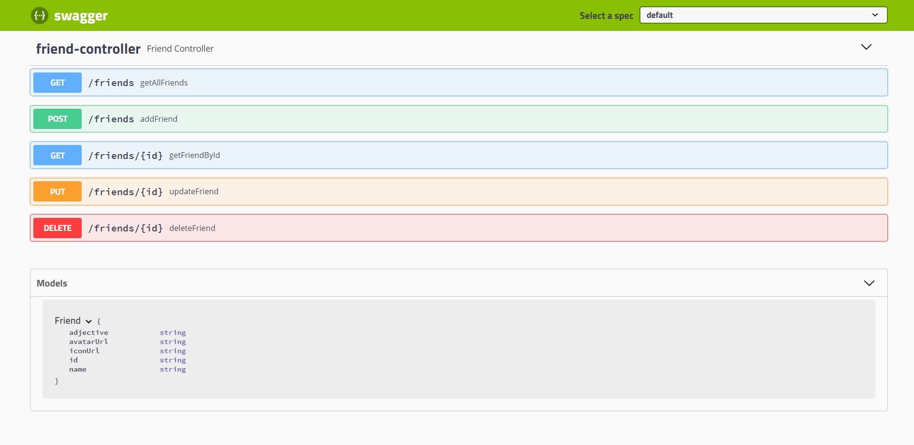
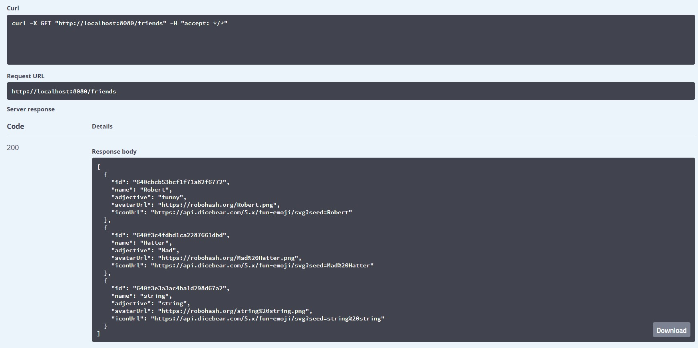
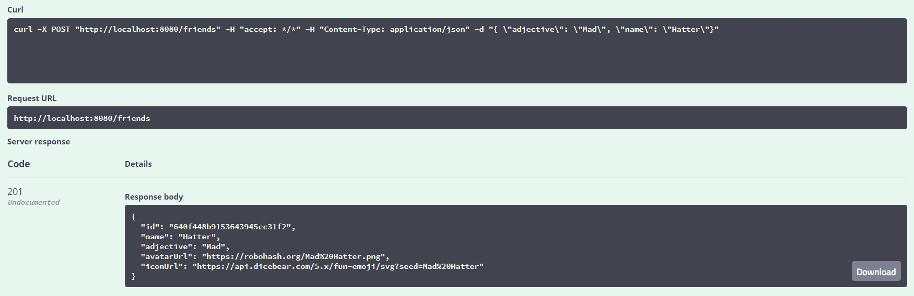
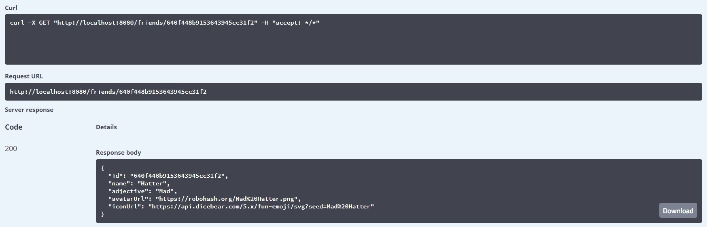
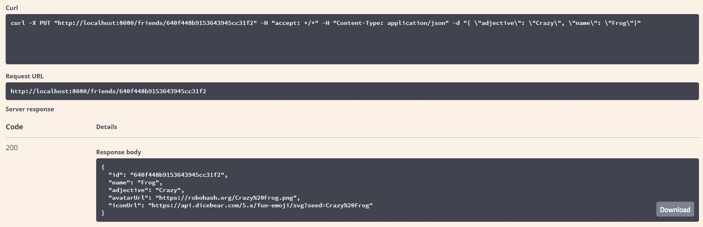
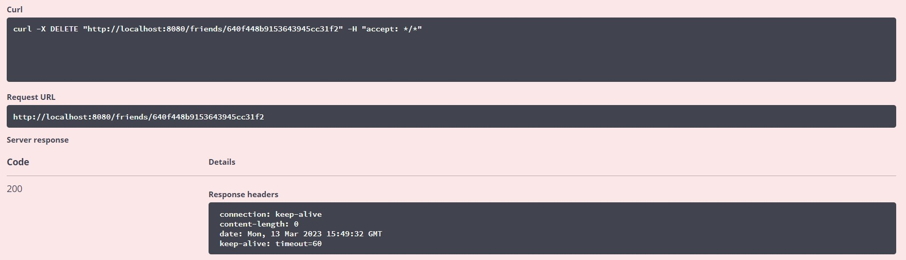

# virtualfriends

This was a side project built to play with the Java Spring Boot framework. It is a simple CRUD application that uses Swagger UI to visualize and interact with the API.

The API is connected to a MongoDB database for data storage.

## Home Page

Swagger UI implements a seamless interface to interact with the API.



# Endpoints

## GET /friends

**curl** 

```sh
curl -X GET "http://localhost:8080/friends" -H "accept: */*"
```

**Sample Response**
```json
[
{
    "id": "640cbcb53bcf1f71a82f6772",
    "name": "Robert",
    "adjective": "funny",
    "avatarUrl": "https://robohash.org/Robert.png",
    "iconUrl": "https://api.dicebear.com/5.x/fun-emoji/svg?seed=Robert"
},
{
    "id": "640f3c4fdbd1ca2287661dbd",
    "name": "Hatter",
    "adjective": "Mad",
    "avatarUrl": "https://robohash.org/Mad%20Hatter.png",
    "iconUrl": "https://api.dicebear.com/5.x/fun-emoji/svg?seed=Mad%20Hatter"
},
{
    "id": "640f3e3a3ac4ba1d298d67a2",
    "name": "string",
    "adjective": "string",
    "avatarUrl": "https://robohash.org/string%20string.png",
    "iconUrl": "https://api.dicebear.com/5.x/fun-emoji/svg?seed=string%20string"
}
]
```

**Web Reference**



## GET /friends

**curl**

```sh
curl -X POST "http://localhost:8080/friends" -H "accept: */*" -H "Content-Type: application/json" -d "{ \"adjective\": \"Mad\", \"name\": \"Hatter\"}"
```

**Sample Response**
```json
{
    "id": "640f448b9153643945cc31f2",
    "name": "Hatter",
    "adjective": "Mad",
    "avatarUrl": "https://robohash.org/Mad%20Hatter.png",
    "iconUrl": "https://api.dicebear.com/5.x/fun-emoji/svg?seed=Mad%20Hatter"
}
```

**Web Reference**



## GET /friends/{id}

**curl**

```sh
curl -X GET "http://localhost:8080/friends/640f448b9153643945cc31f2" -H "accept: */*"
```

**Sample Response**
```json
{
    "id": "640f448b9153643945cc31f2",
    "name": "Hatter",
    "adjective": "Mad",
    "avatarUrl": "https://robohash.org/Mad%20Hatter.png",
    "iconUrl": "https://api.dicebear.com/5.x/fun-emoji/svg?seed=Mad%20Hatter"
}
```

**Web Reference**



## PUT /friends/{id}

**curl**

```sh
curl -X PUT "http://localhost:8080/friends/640f448b9153643945cc31f2" -H "accept: */*" -H "Content-Type: application/json" -d "{ \"adjective\": \"Crazy\", \"name\": \"Frog\"}"
```

**Sample Response**
```json
{
    "id": "640f448b9153643945cc31f2",
    "name": "Frog",
    "adjective": "Crazy",
    "avatarUrl": "https://robohash.org/Crazy%20Frog.png",
    "iconUrl": "https://api.dicebear.com/5.x/fun-emoji/svg?seed=Crazy%20Frog"
}
```

**Web Reference**



## DELETE /friends/{id}

**curl**

```sh
curl -X DELETE "http://localhost:8080/friends/640f448b9153643945cc31f2" -H "accept: */*"
```

**Response Status**

200

**Web Reference**


